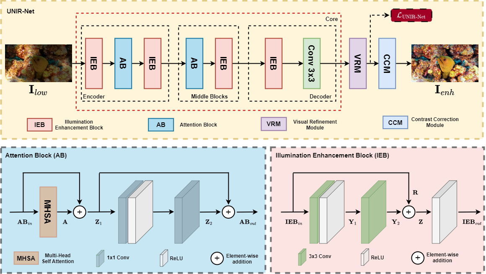

# [IMAVIS'25] UNIR-Net: A Novel Approach for Restoring Underwater Images with Non-Uniform Illumination Using Synthetic Data

## 🎯 1. Overview

This repository contains the source code and supplementary materials for the paper titled **UNIR-Net: A Novel Approach for Restoring Underwater Images with Non-Uniform Illumination Using Synthetic Data**. This research focuses on the visual enhancement of underwater images with non-uniform illumination



## 🛠️ 2. Requirements

1. opencv-python == 4.9.0.80
2. scikit-image == 0.22.0
3. numpy == 1.24.3
4. torch == 2.3.0+cu118
5. Pillow == 10.2.0
6. tqdm ==  4.65.0
7. natsort == 8.4.0
8. torchvision == 0.18.0+cu118

## 🧪 3. Inference
To test the model, follow these steps:


1. Download the pretrained weights from either of the following links, and place them in the `./Models` directory:  
   - [Google Drive](https://drive.google.com/file/d/1uLIrWoW6WEqQDtYNdg-Lx3tGFlYSjavU/view?usp=sharing)

2. Place your images to be enhanced in the ./1_Input directory.

3. Run the code with the following command:

   ```bash
   python inference.py

4. The enhanced images will be saved in the ./2_Output directory.

## 📄 Citation
If this work contributes to your research, we would appreciate it if you could cite our paper:

```bibtex
@article{perez2025unir,
  title={UNIR-Net: A Novel Approach for Restoring Underwater Images with Non-Uniform Illumination Using Synthetic Data},
  author={Perez-Zarate, Ezequiel and Liu, Chunxiao and Ramos-Soto, Oscar and Oliva, Diego and Perez-Cisneros, Marco},
  journal={arXiv preprint arXiv:2501.09053},
  year={2025}
}
